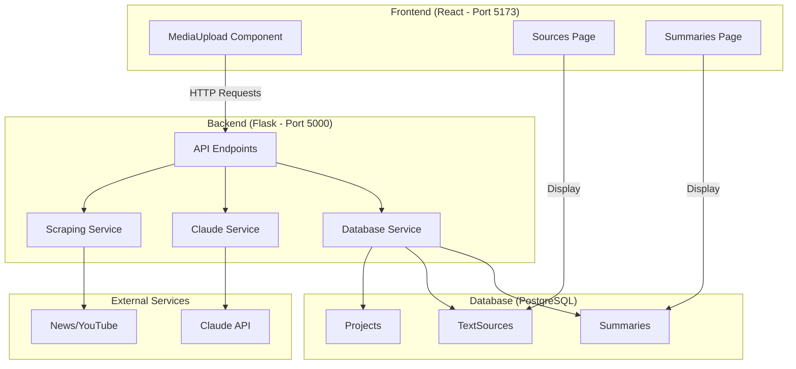

# 🔗 ASL Summarizer - Complete Integration Guide

## 🎯 Overview

This guide provides step-by-step instructions to set up and test the complete ASL Summarizer system with:

- ✅ **Flask Backend API** with real scraping, Claude validation, and summarization
- ✅ **PostgreSQL Database** integration with existing database handler  
- ✅ **React Frontend** connected to real backend APIs
- ✅ **End-to-End Workflow**: Upload → Scrape → Validate → Accept/Reject → Summarize → Store

## 🏗️ System Architecture



## 📋 Prerequisites

### Required Software
- **Python 3.8+** 
- **Node.js 16+** and npm
- **PostgreSQL 12+**
- **Git**

### Required API Keys
- **Anthropic Claude API Key** - Get from [console.anthropic.com](https://console.anthropic.com)

### System Requirements
- **4GB+ RAM** (for Python, Node.js, and PostgreSQL)
- **2GB+ disk space**
- **Internet connection** (for Claude API and content scraping)

## 🚀 Complete Setup

### Step 1: Database Setup

1. **Start PostgreSQL**
   ```bash
   # Ubuntu/Debian
   sudo systemctl start postgresql
   
   # macOS (Homebrew)
   brew services start postgresql
   
   # Windows
   # Start PostgreSQL service through Services panel
   ```

2. **Create Database**
   ```bash
   sudo -u postgres createdb asl_summarizer
   # Or use your preferred PostgreSQL client
   ```

3. **Initialize Database Schema**
   ```bash
   cd c:/Hack-Coms
   python database_handler/scripts/init_db.py
   ```

### Step 2: Backend Setup

1. **Navigate to Backend Directory**
   ```bash
   cd c:/Hack-Coms/backend
   ```

2. **Create Environment Configuration**
   ```bash
   cp .env.example .env
   ```

3. **Configure Environment Variables**
   Edit `.env` file:
   ```env
   # Flask Configuration
   FLASK_ENV=development
   FLASK_DEBUG=True
   FLASK_PORT=5000
   
   # REQUIRED: Add your Claude API key
   ANTHROPIC_API_KEY=sk-ant-api03-your-key-here
   
   # Database Configuration (adjust as needed)
   DB_HOST=localhost
   DB_PORT=5432
   DB_NAME=asl_summarizer
   DB_USER=postgres
   DB_PASSWORD=your_postgres_password
   
   # Frontend CORS
   FRONTEND_URL=http://localhost:5173
   ```

4. **Install Python Dependencies**
   ```bash
   pip install -r requirements.txt
   ```

5. **Start Backend Server**
   ```bash
   python run.py
   # Or use the startup script: chmod +x start.sh && ./start.sh
   ```

   **Expected Output:**
   ```
   Starting ASL Summarizer Backend Server...
   Host: 0.0.0.0
   Port: 5000
   Debug: True
   Environment: development
   ==================================================
   * Running on all addresses (0.0.0.0)
   * Running on http://127.0.0.1:5000
   * Running on http://[::1]:5000
   ```

### Step 3: Frontend Setup

1. **Navigate to Frontend Directory**
   ```bash
   cd c:/Hack-Coms/asl-summarizer-frontend
   ```

2. **Install Node.js Dependencies**
   ```bash
   npm install
   ```

3. **Start Frontend Development Server**
   ```bash
   npm run dev
   ```

   **Expected Output:**
   ```
   VITE v4.2.0  ready in 500 ms
   
   ➜  Local:   http://localhost:5173/
   ➜  Network: use --host to expose
   ```

### Step 4: Verify Integration

1. **Check Backend Health**
   ```bash
   curl http://localhost:5000/health/
   ```

   **Expected Response:**
   ```json
   {
     "status": "healthy",
     "services": {
       "database": "up",
       "claude_api": "configured", 
       "flask": "up"
     }
   }
   ```

2. **Access Frontend**
   - Open http://localhost:5173 in your browser
   - You should see the ASL Summarizer homepage

## 🧪 End-to-End Testing Workflow

### Test 1: News Article Processing

1. **Navigate to Sources Page**
   - Click "Sources" in the navigation

2. **Upload News Article**
   - Select "URL/Link" tab
   - Enter a news article URL (try: `https://www.bbc.com/news/technology`)
   - Click "Process URL"

3. **Watch the Workflow**
   ```
   ✅ Content Extraction (2-5 seconds)
      → Scrapes article text, metadata
   ✅ Claude Validation (3-5 seconds)  
      → Checks for inappropriate content
   ✅ Review Results
      → Shows extracted content + validation
   ✅ Generate Summary (5-10 seconds)
      → Creates summary and stores in database
   ✅ Redirect to Summaries
      → Shows new summary
   ```

### Test 2: YouTube Video Processing

1. **Upload YouTube Video**
   - Use URL like: `https://www.youtube.com/watch?v=dQw4w9WgXcQ`
   - Should extract transcript and validate

### Test 3: File Upload

1. **Upload PDF or Text File**
   - Select "File Upload" tab
   - Upload a PDF or text file
   - Should extract content and validate

### Test 4: Content Rejection

1. **Test Content Filtering**
   - Try entering content with inappropriate keywords
   - Should be rejected by Claude validation

### Test 5: Data Persistence

1. **Check Sources Page**
   - Should display all uploaded and validated content
   - Data comes from PostgreSQL database

2. **Check Summaries Page** 
   - Should display all generated summaries
   - Should show source information
   - Data comes from PostgreSQL database

## 🔍 API Testing (Optional)

### Test Direct API Endpoints

1. **Extract URL Content**
   ```bash
   curl -X POST http://localhost:5000/api/media/extract-url \
     -H "Content-Type: application/json" \
     -d '{"url": "https://example.com/article"}'
   ```

2. **Validate Content**
   ```bash
   curl -X POST http://localhost:5000/api/media/validate \
     -H "Content-Type: application/json" \
     -d '{"content": "This is test content for validation."}'
   ```

3. **Get Stored Sources**
   ```bash
   curl http://localhost:5000/api/sources
   ```

4. **Get Stored Summaries**
   ```bash
   curl http://localhost:5000/api/summaries
   ```

## 🎚️ Configuration Options

### Backend Configuration (`backend/.env`)

| Variable | Description | Required |
|----------|-------------|----------|
| `ANTHROPIC_API_KEY` | Claude API key | ✅ Yes |
| `DB_HOST` | PostgreSQL host | ✅ Yes |
| `DB_PORT` | PostgreSQL port | ✅ Yes |
| `DB_NAME` | Database name | ✅ Yes |
| `DB_USER` | Database user | ✅ Yes |
| `DB_PASSWORD` | Database password | ✅ Yes |
| `FLASK_PORT` | Backend server port | No (default: 5000) |
| `FLASK_DEBUG` | Debug mode | No (default: True) |

### Frontend Configuration

The frontend automatically connects to `http://localhost:5000/api` by default. To change this, set:

```bash
# In asl-summarizer-frontend/.env (create if doesn't exist)
REACT_APP_API_URL=http://localhost:5000/api
```

## 🐛 Troubleshooting

### Common Issues

**1. Database Connection Failed**
```
Error: Failed to initialize database
```
**Solution:**
- Check PostgreSQL is running: `pg_isready`
- Verify database exists: `psql -l | grep asl_summarizer`
- Check credentials in `.env` file

**2. Claude API Error**
```
Error: Content validation failed
```
**Solution:**
- Verify `ANTHROPIC_API_KEY` is set correctly
- Check API key has sufficient credits
- Test with: `curl http://localhost:5000/health/claude`

**3. CORS Errors in Browser**
```
Access to XMLHttpRequest blocked by CORS policy
```
**Solution:**
- Check `FRONTEND_URL` in backend `.env`
- Ensure frontend runs on `localhost:5173`
- Restart backend after changing `.env`

**4. Import Error: database_handler**
```
ModuleNotFoundError: No module named 'database_handler'
```
**Solution:**
- Ensure you're running from correct directory
- Database handler should be in parent directory
- Check Python path in `backend/app/services/database_service.py`

### Debug Tools

1. **Backend Logs**
   - All requests and errors logged to console
   - Check Flask output for detailed error messages

2. **Database Query**
   ```sql
   -- Connect to PostgreSQL and check data
   psql asl_summarizer
   \dt  -- List tables
   SELECT COUNT(*) FROM text_sources;
   SELECT COUNT(*) FROM summaries;
   ```

3. **Frontend Network Tab**
   - Use browser dev tools → Network tab
   - Check API requests and responses

## ✅ Success Criteria

Your integration is successful when:

- ✅ Backend starts without errors on port 5000
- ✅ Frontend starts without errors on port 5173  
- ✅ Health check returns `"status": "healthy"`
- ✅ Can extract content from URLs
- ✅ Claude validation works (accepts/rejects content)
- ✅ Summaries are generated and stored
- ✅ Sources page shows stored content
- ✅ Summaries page shows generated summaries
- ✅ Data persists across browser refreshes

## 🎉 Usage

Once everything is working:

1. **Regular Workflow:**
   - Go to Sources page
   - Upload content (URL or file)
   - Review validation results
   - Accept to generate summary
   - View summaries in Summaries page

2. **Features Available:**
   - News article scraping
   - YouTube video transcript extraction
   - PDF/text file processing
   - AI content validation
   - AI summarization
   - Database storage and retrieval
   - Full frontend-backend integration

## 🔄 Next Steps

The system is now fully integrated! Consider:

- Testing with various content types
- Monitoring API performance
- Adding more validation rules
- Implementing user authentication
- Adding ASL video generation features
- Deploying to production environment

---

**🎯 You now have a complete, integrated ASL Summarizer system with real content processing, AI validation, and database persistence!**