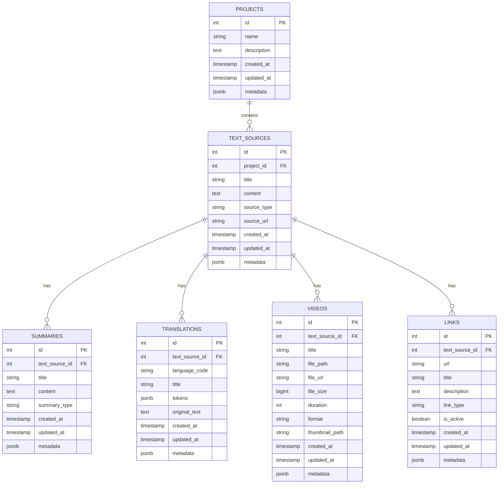

# Database Schema Design for Project Management System

## Overview
This schema supports a hierarchical structure where Projects contain Sources, and Sources contain Summaries, Translations, Videos, and Links as sub-items.

## Database Schema

### Projects Table
```sql
CREATE TABLE projects (
    id SERIAL PRIMARY KEY,
    name VARCHAR(255) NOT NULL,
    description TEXT,
    created_at TIMESTAMP WITH TIME ZONE DEFAULT CURRENT_TIMESTAMP,
    updated_at TIMESTAMP WITH TIME ZONE DEFAULT CURRENT_TIMESTAMP,
    metadata JSONB DEFAULT '{}'
);
```

### Text Sources Table
```sql
CREATE TABLE text_sources (
    id SERIAL PRIMARY KEY,
    project_id INTEGER NOT NULL REFERENCES projects(id) ON DELETE CASCADE,
    title VARCHAR(255) NOT NULL,
    content TEXT NOT NULL,
    source_type VARCHAR(50) DEFAULT 'text', -- 'text', 'document', 'article', etc.
    source_url VARCHAR(500),
    created_at TIMESTAMP WITH TIME ZONE DEFAULT CURRENT_TIMESTAMP,
    updated_at TIMESTAMP WITH TIME ZONE DEFAULT CURRENT_TIMESTAMP,
    metadata JSONB DEFAULT '{}'
);
```

### Summaries Table
```sql
CREATE TABLE summaries (
    id SERIAL PRIMARY KEY,
    text_source_id INTEGER NOT NULL REFERENCES text_sources(id) ON DELETE CASCADE,
    title VARCHAR(255),
    content TEXT NOT NULL,
    summary_type VARCHAR(50) DEFAULT 'general', -- 'general', 'executive', 'technical', etc.
    created_at TIMESTAMP WITH TIME ZONE DEFAULT CURRENT_TIMESTAMP,
    updated_at TIMESTAMP WITH TIME ZONE DEFAULT CURRENT_TIMESTAMP,
    metadata JSONB DEFAULT '{}'
);
```

### Translations Table
```sql
CREATE TABLE translations (
    id SERIAL PRIMARY KEY,
    text_source_id INTEGER NOT NULL REFERENCES text_sources(id) ON DELETE CASCADE,
    language_code VARCHAR(10) NOT NULL, -- 'en', 'es', 'fr', etc.
    title VARCHAR(255),
    tokens JSONB NOT NULL, -- Array of {"token": "word", "pos": 0} objects
    original_text TEXT, -- Store original text for reference
    created_at TIMESTAMP WITH TIME ZONE DEFAULT CURRENT_TIMESTAMP,
    updated_at TIMESTAMP WITH TIME ZONE DEFAULT CURRENT_TIMESTAMP,
    metadata JSONB DEFAULT '{}'
);
```

### Videos Table
```sql
CREATE TABLE videos (
    id SERIAL PRIMARY KEY,
    text_source_id INTEGER NOT NULL REFERENCES text_sources(id) ON DELETE CASCADE,
    title VARCHAR(255),
    file_path VARCHAR(500) NOT NULL, -- Path to video file
    file_url VARCHAR(500), -- URL if hosted externally
    file_size BIGINT, -- File size in bytes
    duration INTEGER, -- Duration in seconds
    format VARCHAR(20), -- 'mp4', 'avi', 'mov', etc.
    thumbnail_path VARCHAR(500), -- Path to thumbnail image
    created_at TIMESTAMP WITH TIME ZONE DEFAULT CURRENT_TIMESTAMP,
    updated_at TIMESTAMP WITH TIME ZONE DEFAULT CURRENT_TIMESTAMP,
    metadata JSONB DEFAULT '{}'
);
```

### Links Table
```sql
CREATE TABLE links (
    id SERIAL PRIMARY KEY,
    text_source_id INTEGER NOT NULL REFERENCES text_sources(id) ON DELETE CASCADE,
    url VARCHAR(500) NOT NULL,
    title VARCHAR(255),
    description TEXT,
    link_type VARCHAR(50) DEFAULT 'reference', -- 'reference', 'source', 'related', etc.
    is_active BOOLEAN DEFAULT TRUE,
    created_at TIMESTAMP WITH TIME ZONE DEFAULT CURRENT_TIMESTAMP,
    updated_at TIMESTAMP WITH TIME ZONE DEFAULT CURRENT_TIMESTAMP,
    metadata JSONB DEFAULT '{}'
);
```

## Indexes for Performance

```sql
-- Project indexes
CREATE INDEX idx_projects_name ON projects(name);
CREATE INDEX idx_projects_created_at ON projects(created_at);

-- Text source indexes
CREATE INDEX idx_text_sources_project_id ON text_sources(project_id);
CREATE INDEX idx_text_sources_title ON text_sources(title);
CREATE INDEX idx_text_sources_source_type ON text_sources(source_type);

-- Summary indexes
CREATE INDEX idx_summaries_text_source_id ON summaries(text_source_id);
CREATE INDEX idx_summaries_summary_type ON summaries(summary_type);

-- Translation indexes
CREATE INDEX idx_translations_text_source_id ON translations(text_source_id);
CREATE INDEX idx_translations_language_code ON translations(language_code);

-- Video indexes
CREATE INDEX idx_videos_text_source_id ON videos(text_source_id);
CREATE INDEX idx_videos_format ON videos(format);

-- Link indexes
CREATE INDEX idx_links_text_source_id ON links(text_source_id);
CREATE INDEX idx_links_link_type ON links(link_type);
CREATE INDEX idx_links_is_active ON links(is_active);
```

## Data Relationships



## Key Features

1. **Hierarchical Structure**: Projects → Text Sources → (Summaries, Translations, Videos, Links)
2. **JSONB Support**: Flexible metadata storage and tokenized translation data
3. **Cascading Deletes**: Automatic cleanup when parent records are deleted
4. **Timestamps**: Automatic tracking of creation and modification times
5. **Flexible Types**: Support for different types of summaries, links, and sources
6. **Performance Optimized**: Strategic indexes for common query patterns

## Token Storage Example

Translations will store tokenized data in the `tokens` JSONB field like this:
```json
[
  {"token": "hello", "pos": 0},
  {"token": "world", "pos": 1},
  {"token": "this", "pos": 2},
  {"token": "is", "pos": 3},
  {"token": "tokenized", "pos": 4}
]