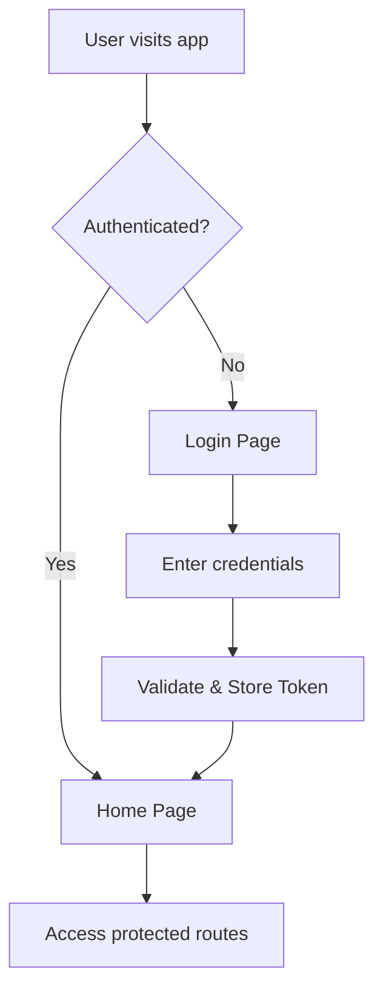
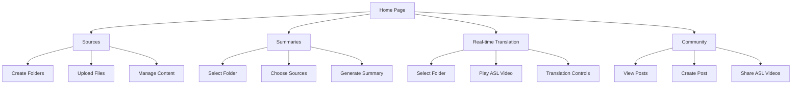

# ASL Article Summarizer - Frontend Architecture Plan

## Project Overview
A React.js frontend application for an article summarizer that converts content to ASL interpretation. The application features user authentication, file management, content summarization, real-time translation, and a community sharing platform.

## Technology Stack
- **Frontend Framework**: React.js with modern JavaScript (ES6+)
- **Styling**: CSS3 with CSS Modules or Styled Components
- **Routing**: React Router v6
- **State Management**: React Context API + useReducer (or Redux if complexity grows)
- **Build Tool**: Vite (recommended) or Create React App
- **File Upload**: React Dropzone
- **HTTP Client**: Axios for API calls
- **UI Components**: Custom components with potential for Material-UI or Chakra UI integration

## Project Structure
```
asl-summarizer-frontend/
├── public/
│   ├── index.html
│   └── favicon.ico
├── src/
│   ├── components/
│   │   ├── common/
│   │   │   ├── Button/
│   │   │   ├── Modal/
│   │   │   ├── LoadingSpinner/
│   │   │   └── ErrorBoundary/
│   │   ├── auth/
│   │   │   ├── LoginForm/
│   │   │   └── ProtectedRoute/
│   │   ├── navigation/
│   │   │   ├── Header/
│   │   │   ├── Sidebar/
│   │   │   └── TabNavigation/
│   │   ├── sources/
│   │   │   ├── FolderTree/
│   │   │   ├── FileUpload/
│   │   │   └── DragDropZone/
│   │   ├── summaries/
│   │   │   ├── FolderSelector/
│   │   │   ├── SourceFilter/
│   │   │   └── SummaryDisplay/
│   │   ├── translation/
│   │   │   ├── ASLVideoPlayer/
│   │   │   └── TranslationControls/
│   │   └── community/
│   │       ├── PostCard/
│   │       ├── PostCreator/
│   │       └── FeedContainer/
│   ├── pages/
│   │   ├── LoginPage/
│   │   ├── HomePage/
│   │   ├── SourcesPage/
│   │   ├── SummariesPage/
│   │   ├── TranslationPage/
│   │   └── CommunityPage/
│   ├── hooks/
│   │   ├── useAuth.js
│   │   ├── useFileUpload.js
│   │   └── useLocalStorage.js
│   ├── services/
│   │   ├── api.js
│   │   ├── authService.js
│   │   ├── fileService.js
│   │   └── mockData.js
│   ├── context/
│   │   ├── AuthContext.js
│   │   ├── DataContext.js
│   │   └── ThemeContext.js
│   ├── utils/
│   │   ├── constants.js
│   │   ├── helpers.js
│   │   └── validators.js
│   ├── styles/
│   │   ├── globals.css
│   │   ├── variables.css
│   │   └── components/
│   ├── App.js
│   └── index.js
├── package.json
└── README.md
```

## Application Flow

### Authentication Flow


### Main Navigation Structure


## Key Features & Components

### 1. Authentication System
- **LoginPage**: Form with email/password validation
- **AuthContext**: Manages authentication state
- **ProtectedRoute**: Guards protected pages
- **Token Management**: JWT token storage and refresh

### 2. Sources Management
- **FolderTree**: Hierarchical folder display with expand/collapse
- **DragDropZone**: File upload with drag-and-drop support
- **FileUpload**: Handles PDF and video file uploads
- **File Organization**: Create, rename, delete folders and files

### 3. Summaries System
- **FolderSelector**: Dropdown/tree view for folder selection
- **SourceFilter**: Checkboxes for individual file selection
- **SummaryDisplay**: Shows generated summaries with formatting

### 4. Real-time Translation
- **ASLVideoPlayer**: Custom video player for ASL content
- **TranslationControls**: Play, pause, speed controls
- **FolderSelection**: Choose source folder for translation

### 5. Community Platform
- **PostCard**: Instagram-like post display
- **PostCreator**: Modal for creating new posts
- **FeedContainer**: Infinite scroll feed of community posts
- **ShareButton**: Share ASL summary videos to community

## Data Models

### User
```javascript
{
  id: string,
  email: string,
  username: string,
  createdAt: Date,
  token: string
}
```

### Folder
```javascript
{
  id: string,
  name: string,
  parentId: string | null,
  userId: string,
  createdAt: Date,
  files: File[]
}
```

### File
```javascript
{
  id: string,
  name: string,
  type: 'pdf' | 'video',
  size: number,
  folderId: string,
  uploadedAt: Date,
  url: string
}
```

### Summary
```javascript
{
  id: string,
  folderId: string,
  sourceFiles: string[],
  content: string,
  aslVideoUrl: string,
  createdAt: Date
}
```

### CommunityPost
```javascript
{
  id: string,
  userId: string,
  username: string,
  summaryId: string,
  aslVideoUrl: string,
  description: string,
  likes: number,
  createdAt: Date
}
```

## API Service Layer

### Authentication Endpoints
- `POST /api/auth/login`
- `POST /api/auth/logout`
- `GET /api/auth/verify`

### File Management Endpoints
- `GET /api/folders`
- `POST /api/folders`
- `PUT /api/folders/:id`
- `DELETE /api/folders/:id`
- `POST /api/files/upload`
- `DELETE /api/files/:id`

### Summary Endpoints
- `POST /api/summaries/generate`
- `GET /api/summaries/:id`
- `GET /api/summaries/folder/:folderId`

### Community Endpoints
- `GET /api/community/posts`
- `POST /api/community/posts`
- `PUT /api/community/posts/:id/like`

## Responsive Design Considerations
- Mobile-first approach
- Tablet and desktop breakpoints
- Touch-friendly drag-and-drop on mobile
- Collapsible navigation for smaller screens
- Optimized video player for different screen sizes

## Development Phases

### Phase 1: Foundation
- Project setup and basic routing
- Authentication system
- Basic UI components

### Phase 2: Core Features
- Sources page with file management
- Summaries page functionality
- Basic styling and responsive design

### Phase 3: Advanced Features
- Real-time translation page
- Community platform
- Enhanced UI/UX

### Phase 4: Polish & Integration
- Error handling and loading states
- Performance optimization
- Backend integration preparation

## Future Considerations
- Progressive Web App (PWA) capabilities
- Offline functionality
- Real-time notifications
- Advanced search and filtering
- User preferences and settings
- Accessibility features for ASL users